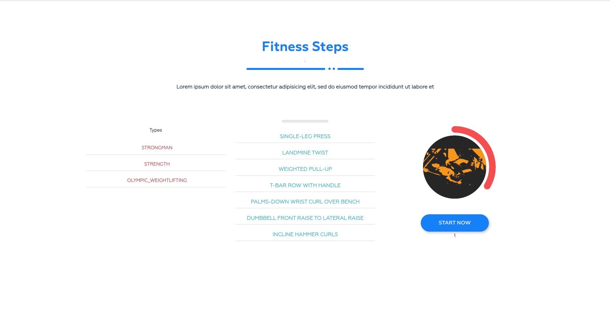

# Fitness Steps

The Fitness Steps is a web application that helps users keep track of their fitness routines, by collecting points through performing selected exercise and achieve their fitness goals. The primary focus of this project is to showcase the implementation of state management using useReducer from React. Whether you're a seasoned athlete or just starting your fitness journey, this tracker provides the tools you need to stay motivated and organized while learning the power of useReducer.

## Technologies Used

## Features

- Multiple exercise types you can choose
- Time tracking with points
- Mobile Friendly: Access the tracker on your computer, tablet, or smartphone for convenience.

## Screenshots

### Home Page

## Installation

1. Clone the repository to your local machine.
2. Navigate to the project directory and install dependencies: `npm install`.
3. Start the development server: `npm start`.
4. Access the website in your browser at `http://localhost:3000`.

## Contributions

Contributions are welcome! If you have any suggestions, improvements, or bug fixes, feel free to submit a pull request.

## Contact

Feel free to reach out to me via email at phillip.mgalan@gmail.com or connect with me on [LinkedIn](https://www.linkedin.com/in/migui-galan/).
